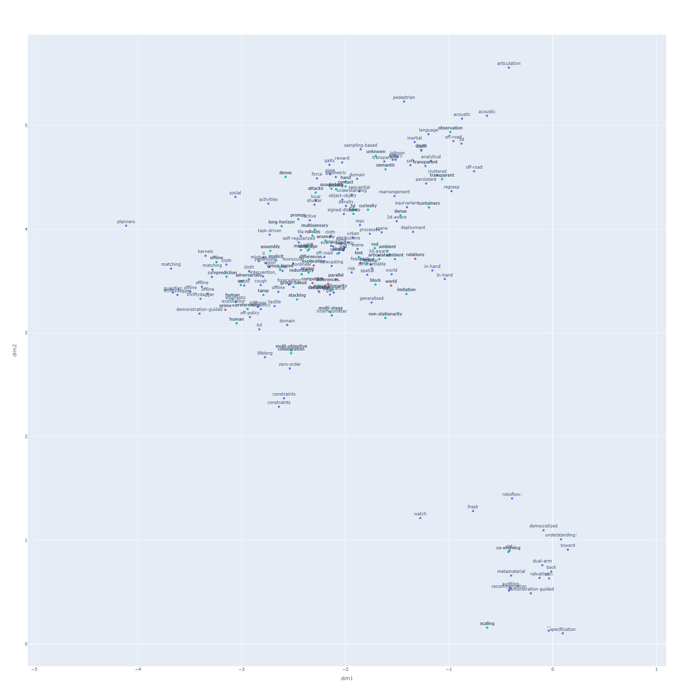

# Explora CoRL 2021 paper space
- This program can map corl 2021 papers into 2D figure.
   - Using doc2vec and tfidf of gensim
- It might help your exploring in the paper space.
- You can update iteratively by excecuting .py file.

## My Environment
- Python 3.8.10  
- plotly 5.3.1
    > pip3 install plotly==5.3.1
- pandas 1.3.4
    > pip3 install pandas==1.3.4

## Procedule 
1. Edit **my_choices.txt** 
    - Please enter your marked paper id in the first row devided with ","
        - It will display as **red**.
    - Please enter the word you want to mark up in the second row. 
        - It will display as **green**.
2. Execute **update_fig_share.py**
    > python3 update_fig_share.py
    - then 2 files are generated.
        - my_choices_summary.csv 
        - corl_allpaper.html 
3. Open up *corl_allpaper.html* using your web browser

- Have fun;)

## Example
i
